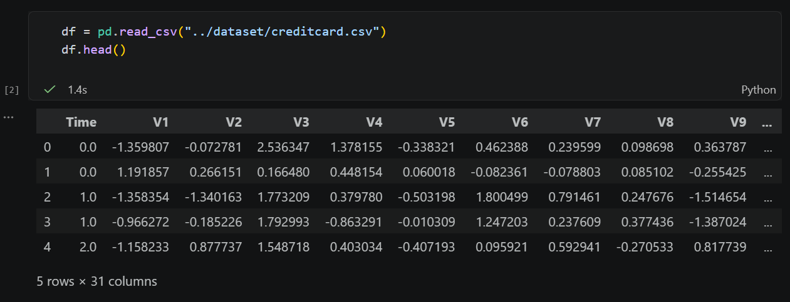
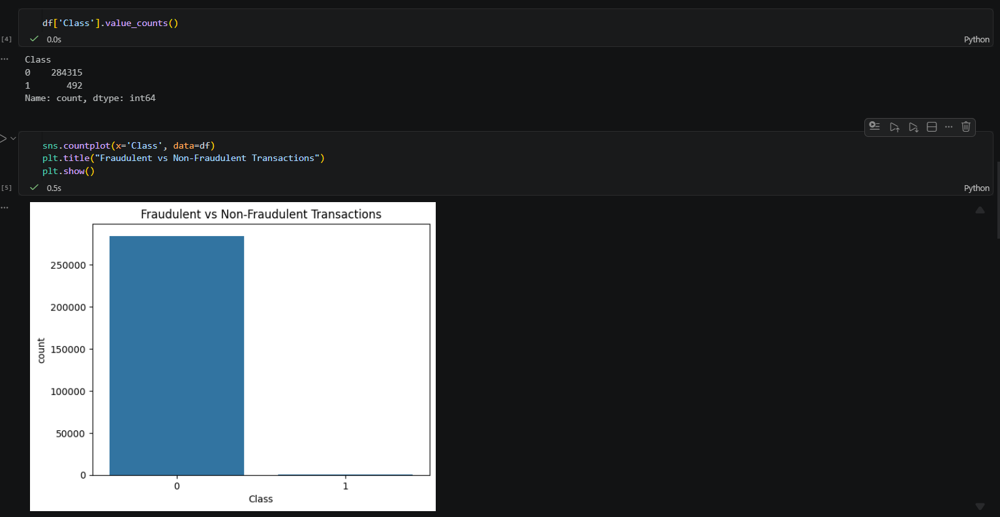
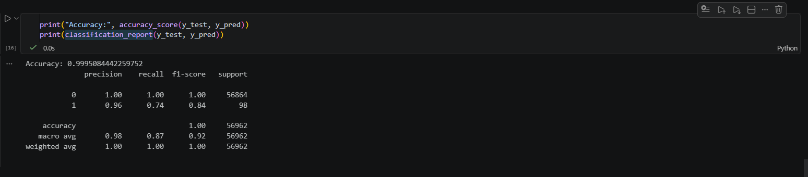
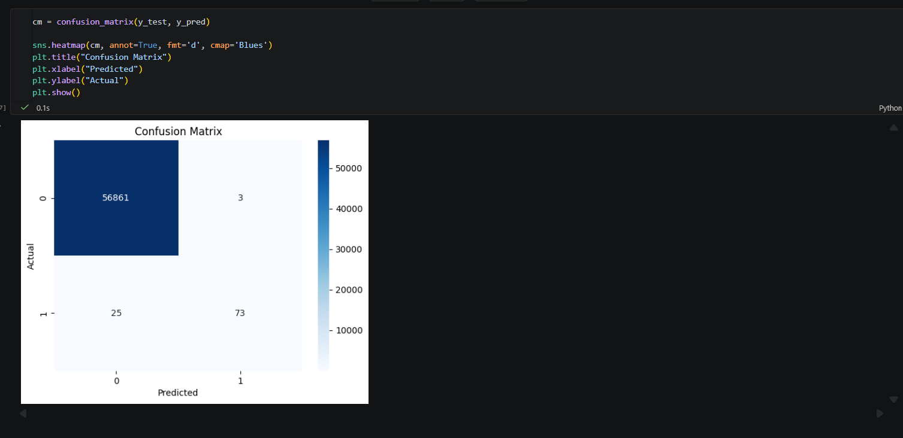
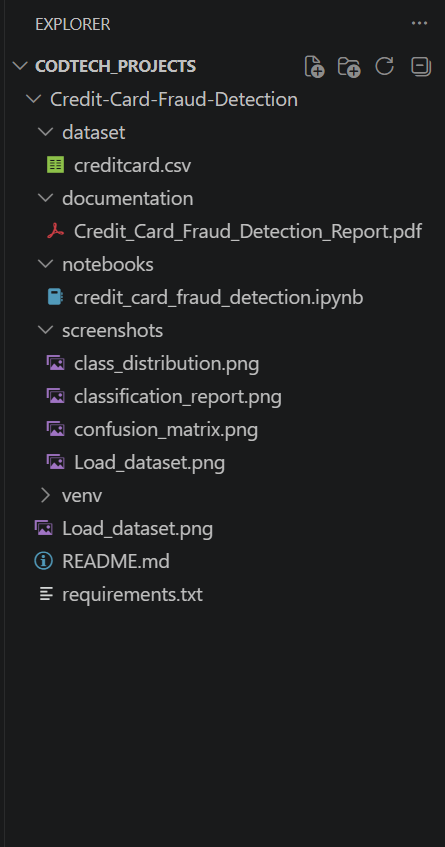

# Credit Card Fraud Detection

## Internship Information

* **Intern ID:** CITS4346
* **Intern Name:** Abhishek M Nair
* **Organization:** CODTECH IT Solutions Private Limited
* **Domain:** Artificial Intelligence
* **Internship Duration:** 8 Weeks
* **Internship Period:** 12 June 2026 – 07 August 2026

---

## Project Name

Credit Card Fraud Detection Using Machine Learning

---

## Project Overview

This project focuses on detecting fraudulent credit card transactions using Machine Learning techniques. The model analyzes transaction data and classifies transactions as either genuine or fraudulent. The objective is to improve financial security by identifying suspicious transactions with high accuracy.

---

## Project Scope

* Data Collection and Preprocessing
* Data Cleaning and Analysis
* Exploratory Data Analysis (EDA)
* Data Visualization
* Machine Learning Model Training
* Fraud Detection Prediction
* Model Evaluation and Performance Analysis

---

## Technologies Used

* Python
* Jupyter Notebook
* VS Code
* Pandas
* NumPy
* Matplotlib
* Seaborn
* Scikit-Learn

---

## Dataset Information

Dataset Name: Credit Card Fraud Detection Dataset

Dataset Source: Kaggle

Target Variable:

* Class 0 → Genuine Transaction
* Class 1 → Fraudulent Transaction

---

## Project Workflow

### Step 1: Data Collection

Downloaded the Credit Card Fraud Detection dataset from Kaggle.

### Step 2: Data Preprocessing

* Loaded dataset using Pandas
* Checked missing values
* Removed duplicate records
* Prepared input and target variables

### Step 3: Data Visualization

* Class Distribution Graph
* Fraud vs Genuine Transaction Analysis

### Step 4: Model Building

Used Random Forest Classifier to train the machine learning model.

### Step 5: Prediction

The trained model predicts whether a transaction is genuine or fraudulent.

### Step 6: Evaluation

Performance was measured using:

* Accuracy Score
* Classification Report
* Confusion Matrix

---

## Results

The machine learning model successfully identified fraudulent transactions with high accuracy and demonstrated strong classification performance.

---

## Screenshots

### Dataset Preview

### Class Distribution Graph

### Model Accuracy Output & Classification Report

### Confusion Matrix

### Project Folder Structure

---

## Folder Structure

Credit-Card-Fraud-Detection/

├── dataset/

├── notebooks/

├── screenshots/

├── documentation/

├── README.md

└── requirements.txt

---

## Future Enhancements

* Deep Learning Based Fraud Detection
* Real-Time Transaction Monitoring
* Web Application Deployment Using Streamlit
* Integration with Financial Systems

---

## Author

**Abhishek M Nair**

CODTECH IT Solutions Private Limited

Artificial Intelligence Internship (8 Weeks)

Intern ID: CITS4346
